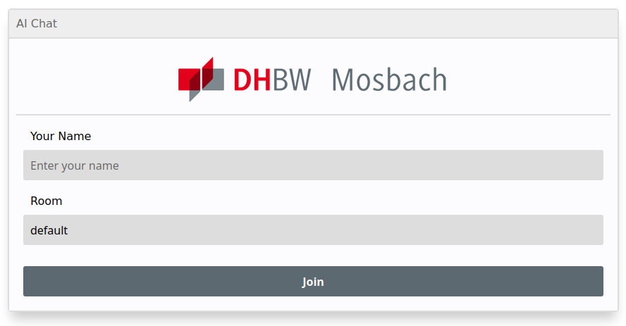
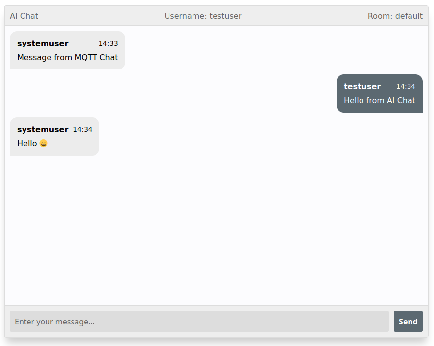

# mqtt_aichat 

This application uses MQTT for a simple chat applications with multiple rooms
you can join.

## Usage 


To build this application, execute the following command from the projects
root directory:

```sh
go build -o build/ ./cmd/mqtt_aichat
```

Make sure that you're connected to the DHBW Mosbach VPN-Server with the 'Lehre'
profile. If you using Linux you can use `openconnect` by running:

```
openconnect https://vpn.mosbach.dhbw.de/Lehre
```

and login with your user credentials.
After that you can run the binary with the following command:

```sh
./build/mqtt_aichat
```

This starts a server on your local machine on port `5556`.
You can connect to this port with http://localhost:5556 and get the simple
user interface.



Here you can choose a username and a room you want to join.
After that you'll be redirected to the chat room and can start chatting with
other people :).


